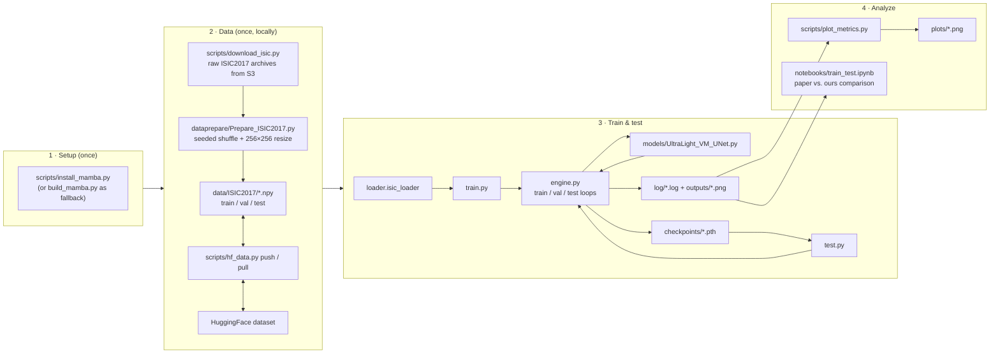
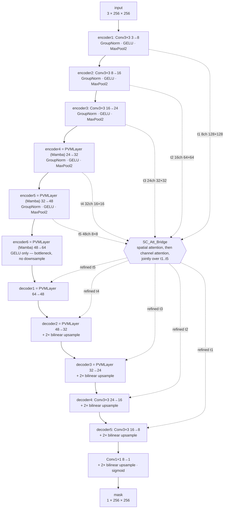

# UltraLight VM-UNet — replication

Replication of **UltraLight VM-UNet: Parallel Vision Mamba significantly reduces parameters for
skin lesion segmentation** (Wu et al., *Patterns* 6, 101298, 2025) — [paper PDF](paper/) ·
[upstream code](https://github.com/wurenkai/UltraLight-VM-UNet).

The goal is a trustworthy, self-owned baseline: reproduce the paper's ISIC2017 numbers first, then
build novelty on top of a result we can defend.

**Target (Table 1, ISIC2017):** DSC 0.9091 · IoU 0.8334 · ACC 0.9646 · SE 0.9053 · SP 0.9790 ·
Prec 0.9481, at 0.049 M params / 0.060 GFLOPs.

### Status

| check | paper | ours | |
|---|---|---|---|
| parameters | 49,457 (0.049 M) | **49,457** | exact |
| GFLOPs | 0.060 | **0.0602** | see note below |
| selective scan | `mamba_ssm` | **`mamba_ssm` 2.3.2.post1** | the paper's fused CUDA kernel |
| equivalence tests | — | 44/44 pass | kernel vs. reference scan: init bit-exact, fwd/grads to fp32 tolerance |
| ISIC2017 DSC | 0.9091 | **0.9026** | **−0.0065 — replicated** |
| ISIC2018 DSC | 0.8940 | **0.8911** | **−0.0029 — replicated** |
| PH2 DSC | 0.9265 | **0.9312** | **+0.0047 — replicated** (40-image test set, see caveat below) |
| HAM10000 DSC | — (not in paper) | **0.9331** | generalization beyond the paper's evaluation set |
| 250-epoch run | — | 22.9 min (ISIC2017) | RTX 5060, 5.2 s/epoch |

**Replication successful.** Run 3 — the first on `mamba_ssm`'s fused kernel — landed DSC 0.9026
against the paper's 0.9091, a 0.71% gap and inside the ±0.01 band set beforehand. ACC matches to
0.0003 and SP is +0.0018; SE is −0.0136.

Two things that run confirmed beyond the headline number. It reproduced run 2 (the same experiment
on the pure-PyTorch scan) to **0.0004 DSC**, which is the empirical version of the equivalence the
test suite asserts analytically. And the one metric that misses badly, precision at −0.0343, turns
out to be a defect in the paper's table rather than in the run: DSC is the harmonic mean of
precision and recall, and the paper's own 0.9481/0.9053 imply DSC 0.9262, not the 0.9091 it
reports. The precision consistent with its *own* DSC and SE is 0.9129, against our 0.9138.

Run 1 had come in 4.1 DSC points low purely because of a biased split (sorting the file listing
gave train/val/test lesion areas of 22.9% / 8.0% / 15.0%, since ISIC IDs correlate with acquisition
source); a seeded permutation fixed the balance to 20.0% / 17.6% / 18.6% and recovered +0.0348 DSC.
Full analysis in [results/COMPARISON.md](results/COMPARISON.md).

**ISIC2018, PH2, and HAM10000.** The same architecture and recipe also replicate the paper's
ISIC2018 (0.29% DSC gap) and PH2 (+0.47%, though PH2's test set is only 40 images — see the caveat
in COMPARISON.md) results, completing all three of the paper's benchmark datasets, and generalize to
HAM10000 — a dataset the paper never evaluates on — at DSC 0.9331, the highest of the four.
ISIC2018 shows notably higher per-image variance (std 0.1380) and more low-Dice outliers than the
other three; see the [cross-dataset summary](results/COMPARISON.md#cross-dataset-summary) for
details and per-image breakdowns.

> **On GFLOPs.** thop reads **0.0602** against the paper's 0.060 — three decimals, straight off the
> measurement, and for a reason worth stating explicitly. thop can only count operations that pass
> through an `nn.Module.forward`, and on the fused path Mamba's internals never do: `mamba_inner_fn`
> receives `conv1d.weight`, `x_proj.weight`, `dt_proj.weight` and `out_proj.weight` as plain tensors
> and does the work itself, so thop sees none of it. The paper's environment had exactly the same
> blind spot, which is why the two agree.
>
> Point the same measurement at the pure-PyTorch oracle, where those operations *are* real module
> calls, and it reads **0.0649**. Both numbers are correct and they are counting different things:
> 0.0649 is closer to this network's honest arithmetic cost, 0.060 is the one comparable to the
> paper. (Before the migration this repo had to reach 0.0602 by subtracting the three module calls
> by hand; now it is what the tool prints.)

## Architecture

### Pipeline



Four stages, each a separate script or module so any one can be re-run or swapped in
isolation. Setup and data preparation happen **once**; every machine after that consumes
the identical prepared `.npy` split (via HuggingFace), so nothing about train/val/test
membership can drift between a local box and a Kaggle session. Train/test and analyze can
then be repeated as many times as needed.

### Model

UltraLight VM-UNet is a 5-level U-Net — an encoder/decoder with skip connections — where
the three stages nearest the bottleneck replace an ordinary conv block with a **PVM
layer** (Parallel Vision Mamba), a state-space-model block adapted from the Mamba
architecture. The five skip connections are refined by a spatial-then-channel attention
bridge (`SC_Att_Bridge`) before being added back in the decoder, rather than passed
through raw.



**PVMLayer**, the block that makes this "ultra-light": flatten the `(B, C, H, W)`
feature map into a sequence `(B, L=H×W, C)`, split the channel dimension into 4 equal
chunks, run all 4 chunks through **one shared Mamba block** — stacked on the batch axis
so it's a single kernel launch, not four (see §2 of "Deviations from upstream" below) —
then concatenate and project back down. Sharing one small Mamba block across 4 channel
groups, rather than giving every stage its own full-width conv stack, is most of where
the 49,457-parameter budget comes from.

## Learning path

If the diagrams above didn't fully click, this is the order we'd suggest closing the
gaps in — each step only assumes the ones before it.

1. **PyTorch fundamentals.** `nn.Module`, the forward/backward/autograd cycle,
   `Dataset`/`DataLoader`. Start here if anything in `engine.py`'s training loop looks
   unfamiliar — nothing below will make sense without it.
2. **Convolutional networks.** What a conv layer, a pooling layer, and a normalization
   layer (`BatchNorm`/`GroupNorm`) actually do to a feature map. `encoder1`–`encoder3`
   and `decoder4`–`decoder5` in `models/UltraLight_VM_UNet.py` are plain instances of
   this — no Mamba involved.
3. **Semantic segmentation & U-Net.** The original U-Net paper (Ronneberger, Fischer &
   Brox, 2015). The one idea to take from it: an encoder that downsamples loses spatial
   precision, and a decoder that only upsamples can't recover fine boundaries on its
   own — skip connections carry the missing detail across. Every `torch.add(outN, tN)`
   in `UltraLight_VM_UNet.forward` is that idea.
4. **Segmentation losses & metrics.** Binary cross-entropy, Dice loss (`utils.py`'s
   `DiceLoss`/`BceDiceLoss`), and why Dice/F1, IoU, sensitivity, and specificity are
   reported together (`engine.py`'s metric block; the identity
   `IoU = DSC / (2 − DSC)` worked out in `results/COMPARISON.md`).
5. **Attention: channel and spatial.** Squeeze-and-excite-style channel attention
   (global pool → small projection → per-channel gate) and spatial attention (per-pixel
   gate from a pooled feature map). `Channel_Att_Bridge` and `Spatial_Att_Bridge` in
   `models/UltraLight_VM_UNet.py` are direct, readable implementations of both.
6. **Sequence models → state space models → Mamba.** The chain that matters here: RNNs
   are sequential and slow to train; S4-family state-space models process a sequence
   through a linear recurrence that can be computed efficiently; Mamba (Gu & Dao, 2023)
   makes that recurrence *input-dependent* ("selective") and ships a fused CUDA kernel
   to keep it fast despite the added sequential dependency. This is the conceptually
   hardest, most repo-specific topic —
   [`models/mamba_pytorch.py`](models/mamba_pytorch.py)'s `selective_scan_ref` is a
   pure-Python, line-by-line realization of the recurrence, worth stepping through
   directly.
7. **Applying Mamba to images (Vision Mamba / PVM).** A Mamba block expects a 1-D
   sequence; a feature map is 2-D. `PVMLayer.forward` shows the whole trick: flatten
   `H×W` into one sequence dimension `L`, run the scan, reshape back. The "Parallel" in
   PVM is the 4-way channel split described under §Model above — this paper's specific
   contribution on top of vanilla Vision Mamba.
8. **The two papers directly behind this repo.** [`paper/`](paper/) (Wu et al.,
   *Patterns*, 2025) — the model this replicates — and the paper it builds on: Gu &
   Dao, *Mamba: Linear-Time Sequence Modeling with Selective State Spaces*, 2023.
9. **Replication engineering, as demonstrated in this repo specifically** — a skill,
   not a concept: pinning a fused CUDA kernel against a pure-PyTorch oracle at every
   layer shape a model actually uses ([`tests/test_mamba_equivalence.py`](tests/test_mamba_equivalence.py)),
   diagnosing a biased data split from a metric *error signature* rather than guessing
   (`results/COMPARISON.md`'s run 1 → run 2 story), and treating "does this match the
   paper within a stated tolerance" as the finish line rather than "does it run."
   Reading "Deviations from upstream" below end to end is the fastest way to see this
   kind of reasoning applied repeatedly.

## Where things run

| | machine | role |
|---|---|---|
| Local | Linux, RTX 5060 Laptop (Blackwell, sm_120) | everything — tests, benchmarks, the 250-epoch runs |
| Optional | Kaggle, 2 × T4 | a second machine for running experiments in parallel — see [`kaggle/`](kaggle/) |
| Data | HuggingFace dataset | prepared `.npy` splits, shared by both |

Preprocessing and the train/val/test split happen **once, locally**. Every machine then consumes
the identical prepared bytes, so nothing about the split can drift between them.

## Setup

Beyond torch there are two CUDA extensions, `mamba_ssm` and `causal_conv1d`. Neither ships a usable
wheel on PyPI — only an sdist that compiles for tens of minutes against a CUDA toolkit — so they
get their own install step.

```bash
python3 -m venv .venv && source .venv/bin/activate
pip install torch==2.10.0 torchvision==0.25.0 --index-url https://download.pytorch.org/whl/cu129
python scripts/install_mamba.py       # prebuilt wheels matching the installed torch
pip install -r requirements.txt
```

torch is pinned because the wheels in step 2 are published per torch minor, and 2.10 is the newest
they cover. A newer torch is fine — it just means compiling instead, which is the next section.

Two hard constraints, both about Blackwell (sm_120):

- **torch ≥ 2.7 built with CUDA ≥ 12.8.** 2.7.0 was the first stable release shipping sm_120
  kernels. The `torch 2.0.1+cu117` this project used to pin stops at sm_86 and embeds only
  `compute_37` PTX, so it cannot execute here at all.
- **a cu12 or cu13 `mamba_ssm` wheel, never cu11.** Its setup.py emits an sm_120 cubin only when
  the build ran against CUDA ≥ 12.8 (its release CI uses 11.8.0, 12.9.1 and 13.0.1), and it ships
  no forward-compatible PTX for the driver to JIT from.

Both are checked by executing a real kernel — `utils.check_environment`, called at the top of
`train.py` and `test.py`, and cell 1 of the notebook.

### When there is no matching wheel

`mamba_ssm` publishes wheels per torch minor, currently 2.6 through 2.10. On anything newer,
`scripts/install_mamba.py` says so and stops, and the fallback is to compile:

```bash
python scripts/build_mamba.py         # ~4 minutes on 8 cores
```

That script installs `nvcc` and the CUDA headers from pip (no system CUDA, no root), assembles them
into a `CUDA_HOME` next to the venv, and restricts the build to this GPU's architecture — mamba's
setup.py otherwise compiles every kernel nine times over, once per architecture it knows.

**The environment this was last verified on** is exactly that path: torch 2.13.0+cu130, with
`mamba_ssm` 2.3.2.post1 and `causal_conv1d` 1.6.2.post1 compiled from source for sm_120 only.

Two things that bit during that build, both encoded in the script so they cannot bite again. The
`nvidia-cuda-nvcc-cu13` package name resolves on PyPI to an **empty 0.0.1 placeholder** — under
CUDA 13 the components dropped the `-cu13` suffix — so the wrong name installs nothing and reports
success. And CUDA's components must be one consistent set: a 13.0 `ptxas` paired with a 13.3 front
end rejects its own PTX, and CUDA 13.0's headers do not compile against glibc ≥ 2.41 at all
(`exception specification is incompatible with that of previous function "rsqrt"`).

## Data

```bash
python scripts/download_isic.py --dataset ISIC2017   # 5.8 GB from the ISIC S3 bucket
python dataprepare/Prepare_ISIC2017.py               # -> data/ISIC2017/*.npy  (~525 MB)
python scripts/hf_data.py push --dataset ISIC2017            # -> RohanRamesh/ultralight-vmunet-data
```

Then on any machine (including a Kaggle notebook), skip straight to:

```bash
python scripts/hf_data.py pull --dataset ISIC2017
```

Both default to the private `RohanRamesh/ultralight-vmunet-data` repo; pass `--repo` to override.
Set `HF_TOKEN`, or log in once with `huggingface-cli login`.

### Prepared ISIC2017 splits

Built from `ISIC-2017_Training_Data.zip` (5.8 GB, 2000 JPEGs) and
`ISIC-2017_Training_Part1_GroundTruth.zip` (8.9 MB, 2000 PNGs), both from
`isic-challenge-data.s3.amazonaws.com`. The 2001 superpixel/licence files bundled in the image
archive are discarded. 524 MB total.

Split with `SPLIT_SEED = 42`.

| file | shape | dtype | sha256 (file) |
|---|---|---|---|
| `data_train.npy` | (1250, 256, 256, 3) | uint8 | `d8f1101f99fd7be6…` |
| `data_val.npy` | (150, 256, 256, 3) | uint8 | `3c7fe7c64546c094…` |
| `data_test.npy` | (600, 256, 256, 3) | uint8 | `4f2e920a0fda6bab…` |
| `mask_train.npy` | (1250, 256, 256) | uint8 | `10563338a5bff3b6…` |
| `mask_val.npy` | (150, 256, 256) | uint8 | `ff0ec2327b170f6b…` |
| `mask_test.npy` | (600, 256, 256) | uint8 | `d28c772b730a0847…` |

Verified: a clean partition of exactly 2000 unique images, with mean lesion area balanced across
splits at 20.0% / 17.6% / 18.6%; masks carry 1.02% intermediate values (bilinear edge blur, as
expected); the loader yields images in **[0, 255]** — not [0, 1] — and masks in [0, 1], matching
upstream.

## Run

```bash
python -m pytest tests/ -q          # kernel-vs-oracle equivalence + parameter counts
python train.py                     # writes to results/<network>_<dataset>_<timestamp>/
python test.py --weights results/<run>/checkpoints/best-epoch116-loss0.2545.pth
python scripts/plot_metrics.py --work-dir results/<run>/   # loss/metric/confusion-matrix plots
```

`train.py` prints the parameter count and GFLOPs at startup, trains for 250 epochs, writes
`checkpoints/latest.pth` every epoch (so an interrupted run resumes automatically), and evaluates
the best checkpoint on the test split at the end. [`notebooks/train_test.ipynb`](notebooks/) drives
the same thing cell by cell, with a preflight and a comparison against the paper's table.

`test.py` re-evaluates any checkpoint standalone — `--work-dir` defaults to a fresh timestamped
directory, so pass the checkpoint's own run directory to append to its existing log instead
(`test.py`'s docstring has the full flag list). `scripts/plot_metrics.py` reads
`<work_dir>/log/*.log` (no separate history file is kept) and writes six PNGs to
`<work_dir>/plots/`: training/validation loss, the learning-rate schedule, validation DSC/IoU/
accuracy/sensitivity/specificity over epochs, the final test confusion matrix, a paper-vs-ours bar
chart, and a per-image test-DSC histogram. With no `--work-dir` it picks the most recently modified
`results/*/` directory; it can also be called as `scripts.plot_metrics.generate_all(work_dir)` from
a notebook cell, as [`notebooks/train_test.ipynb`](notebooks/) does.

On a two-GPU machine, pin each run to one GPU rather than splitting one across both — at 0.049 M
parameters the bottleneck is per-launch overhead, which `DataParallel` adds to:

```bash
CUDA_VISIBLE_DEVICES=0 python train.py   # e.g. ISIC2017
CUDA_VISIBLE_DEVICES=1 python train.py   # e.g. ISIC2018, concurrently
```

Other commands worth knowing:

```bash
python scripts/bench_batch.py                 # throughput/VRAM vs. batch size on this GPU
python -m pytest tests/test_log_parsing.py -q  # just the log-parsing tests (no GPU needed)
```

## Deviations from upstream

Every difference from https://github.com/wurenkai/UltraLight-VM-UNet is listed here. Anything not
in this list is a verbatim transcription — everything in `models/UltraLight_VM_UNet.py` below
`PVMLayer` in particular is byte-identical.

### 1. `mamba_ssm` 2.3.2.post1, not the pinned 1.0.1

Upstream pins `mamba_ssm==1.0.1` + `causal_conv1d==1.0.0`. 1.0.1 dates from December 2023 and
predates Blackwell: its setup.py emits cubins for sm_70/80/90 and no forward-compatible PTX, so
there is no way to make it execute on an RTX 5060, whatever it is compiled against.

2.3.2.post1 is used instead, and the substitution is narrow. The file the model imports,
`mamba_ssm/modules/mamba_simple.py`, differs from 1.0.1's in four places, none of which touch the
training-path arithmetic:

| change | effect here |
|---|---|
| `selective_scan_fn`/`mamba_inner_fn` imported unguarded; `causal_conv1d` import guarded instead | none — both are installed |
| `causal_conv1d_fn` called with keyword rather than positional arguments | none — same call |
| `conv_state` updated through `F.pad` so `seqlen < d_conv` cannot error | inference-cache path only, which this model never takes |
| `class Block` moved out to `modules/block.py` | not used by this model |

`Mamba.__init__` and the training forward are otherwise identical, character for character.

The tests take that further and check it empirically rather than by reading diffs — see
[How the kernel is verified](#how-the-kernel-is-verified).

What the fused kernel buys, measured at batch 8 on the RTX 5060: **0.0122 s/iter against 0.0198**
for the pure-PyTorch scan, so 1.6× on the training step. Worth having, but the reason to run it is
fidelity rather than speed — this is the code path the paper's numbers came from. At `d_inner`
12–32 over sequences of at most 1024 tokens there is very little for a fused kernel to accelerate;
it exists to make `d_inner` in the thousands tractable.

At 157 iterations per epoch that is under 2 s of GPU work, against a measured 5.2 s/epoch end to
end — so the CPU-side `scipy.ndimage.rotate` augmentation on the main thread (`num_workers = 0`) is
now most of the wall clock, and the single biggest remaining speedup. It is left alone deliberately:
raising `num_workers` changes the augmentation RNG stream, and so the training trajectory, for a
speedup a 22-minute run does not need.

### 2. The four PVM branches run as one batched call

`PVMLayer.forward` calls the *same* `self.mamba` four times in sequence. Mamba treats the batch
dimension as independent — every operation is either per-token or a scan along `L` — so the four
branches stack onto the batch axis and become one call. Measured at batch 8 on the RTX 5060,
**0.0117 s/iter against 0.0227 s/iter** for the four-call form — 1.93× on the training step, for
arithmetic that is identical. (Each quoted pair here and in §1 comes from one benchmark run;
run-to-run variation is a few percent, so compare within a pair, not across.)

`_forward_reference` keeps upstream's exact four-call form, and `tests/test_pvm_batching.py`
asserts the two agree at every layer shape, on outputs *and* on all parameter gradients, plus end
to end through the whole model.

### 3. Data prep without SciPy 1.2

`dataprepare/Prepare_ISIC2017.py` is rewritten to use Pillow instead of `scipy.misc.imread` /
`imresize` (removed in SciPy ≥ 1.3; upstream's workaround is a second Python 3.7 conda environment).
Two substantive changes:

- **Seeded shuffle before splitting** (`SPLIT_SEED = 42`). Upstream slices raw `glob.glob()` order,
  which is filesystem-dependent and so not reproducible. Sorting instead is reproducible but
  *wrong*: ISIC IDs correlate with acquisition source, so contiguous slices are biased — the sorted
  split gave train/val/test mean lesion areas of 22.9% / 8.0% / 15.0% and cost 4.1 DSC points.
  A seeded permutation is reproducible **and** unbiased, and is the closest honest analogue of the
  paper's "randomly divided". See [results/COMPARISON.md](results/COMPARISON.md).
- **uint8 storage.** `scipy.misc.imresize` returned uint8 and upstream immediately widened it with
  `np.double()`, so keeping the uint8 is lossless with respect to the original pipeline — and takes
  the `.npy` output from ~4 GB to ~525 MB. `loader.dataset_normalized` casts to float32.

### 4. Small environment patches

None of these change the training trajectory.

- `models/UltraLight_VM_UNet.py`: `trunc_normal_` imported from `timm.layers`, with a fallback to
  the `timm.models.layers` shim it moved out of in timm 0.9.
- `requirements.txt` lists `transformers`, which nothing here uses. `mamba_ssm`'s package `__init__`
  imports `MambaLMHeadModel`, which imports it, so `from mamba_ssm import Mamba` — upstream's own
  import line — needs it present. Both install scripts pass `--no-deps`, on the grounds that a
  dependency resolver let loose near a hand-installed CUDA torch is a hazard, so it is listed
  explicitly rather than arriving by accident.
- `train.py` / `test.py`: `DataParallel` wrapper dropped for single-GPU use, and the matching
  `.module` indirection with it. Checkpoint keys are unchanged — upstream saved
  `model.module.state_dict()`, which produces the same un-prefixed keys.
- `train.py` / `test.py`: `torch.load(..., weights_only=False)`. torch ≥ 2.6 flipped that default
  to `True`, which **rejects these checkpoints** — `min_loss` and `loss` are `np.float64`, because
  `engine.py` returns `np.mean(...)`, and numpy scalars are not in the default allowlist. Without
  it a fresh run works and only *resuming* crashes, which is the worst time to find out.
- `test.py`: `--weights` / `--work-dir` arguments, so a checkpoint can be evaluated without editing
  the config, and a strip of thop's `total_ops`/`total_params` buffers from older checkpoints.
- `utils.py`: `cal_params_flops` profiles a deep copy. `thop.profile` registers `total_ops` /
  `total_params` buffers on every submodule and never removes them, so they land in every
  checkpoint written afterwards and make it unloadable into a fresh model.
- `utils.py`: matplotlib `Agg` backend, since `save_imgs` writes ~600 PNGs headlessly.
- `loader.py`: float32 rather than float64 arrays (`engine.py` casts to `.float()` on the GPU
  regardless).
- `configs/config_setting.py`: `data_path` filled in and resolved relative to the file, so the
  notebook works from any working directory. `val_batch_size = 30` and `test_batch_size = 1` are
  new settings; validation takes no gradients, so batching it is a pure speed change. Measured over
  the 150 val images it shifts the reported loss by 6e-5 (fp32 reduction-order noise) and runs 20×
  faster. It **must divide the split exactly** — the val/test loaders use `drop_last=True`, so a
  non-divisor silently discards images, and `train.py` asserts rather than trusting it.
- All hyperparameters are untouched — batch 8, 250 epochs, AdamW lr 1e-3 / wd 1e-2,
  CosineAnnealingLR `T_max=50` `eta_min=1e-5`, seed 42, threshold 0.5, `amp=False`, 256×256 input,
  `c_list=[8,16,24,32,48,64]`.

### 5. Dead code removed

Upstream carries a fair amount that never executes. Removed, having checked each one is genuinely
unreachable rather than merely unused-looking:

- unused imports: `nn` and `autocast` in `train.py`/`test.py`, `sys` once its only use went,
  `torch.nn.functional`/`torchvision.transforms.functional` in `utils.py`, and six in `loader.py`
  (`DataLoader`, `os`, `PIL.Image`, `einops.Rearrange`, `scipy.ndimage.binary_dilation`,
  `torchvision.transforms`) — including the `scipy.ndimage.morphology` import this repo previously
  repointed at `scipy.ndimage`, which was simpler to delete than to fix.
- `gpu_ids = [0]`, left behind when the `DataParallel` wrapper went.
- `sys.path.append(work_dir)` in both scripts: appending a results directory to the import path
  imports nothing.
- the optimiser, scheduler, `GradScaler` and `min_loss`/`start_epoch`/`min_epoch` that `test.py`
  built and never read — evaluation takes no gradients and no steps.
- the `else: # default opt is SGD` fallback in `get_optimizer`. The assert above it restricts
  `config.opt` to nine names and all nine have a branch, so it was unreachable.
- `dataset_normalized`'s `np.empty(imgs.shape)`, allocated and then immediately rebound.

Deliberately **not** removed: the optimiser and scheduler menus in `configs/config_setting.py` and
`utils.py`. Only the AdamW and CosineAnnealingLR branches run, but the others are the mechanism for
changing optimiser, not dead weight. `engine.py` also keeps its two near-identical metric blocks —
it is verbatim upstream on purpose, and that is worth more than the duplication costs.

Verified by re-running the whole pipeline on a synthetic split before and after: same loss to four
decimals, same confusion matrix.

### Unchanged on purpose

`engine.py` is verbatim. Its metrics pool a confusion matrix over **all pixels of an entire split**
rather than averaging per-image scores. That is how the paper's numbers are defined, so it stays
as-is even though per-image averaging is more common elsewhere.

## How the kernel is verified

A fused CUDA kernel is opaque: if it computed something subtly different from the scan in the
paper, nothing about the loss curve would say so. [`models/mamba_pytorch.py`](models/mamba_pytorch.py)
exists to close that hole. It is a pure-PyTorch reimplementation of the same block —
`selective_scan_ref` is the reference scan from the official Mamba repository, the one its CUDA
kernel is tested against — and it is **not** in the training path; nothing imports it but the
tests.

[`tests/test_mamba_equivalence.py`](tests/test_mamba_equivalence.py) then pins the kernel against
it at the six shapes this model actually runs:

| PVM layer | `d_model` | `d_inner` | `dt_rank` | seq len @ 256×256 |
|---|---|---|---|---|
| encoder4 (24→32) | 6 | 12 | 1 | 1024 |
| encoder5 (32→48) | 8 | 16 | 1 | 256 |
| encoder6 (48→64) | 12 | 24 | 1 | 64 |
| decoder1 (64→48) | 16 | 32 | 1 | 64 |
| decoder2 (48→32) | 12 | 24 | 1 | 64 |
| decoder3 (32→24) | 8 | 16 | 1 | 256 |

- **initialisation, bit for bit.** Same seed, same weights — for the `Mamba` block and for the
  whole 49,457-parameter network built on either backend. This is load-bearing:
  `UltraLight_VM_UNet.__init__` ends with `self.apply(self._init_weights)`, which reinitialises
  every `nn.Linear` and `nn.Conv1d` in the model, including the ones inside Mamba and including
  `dt_proj.bias`, whose `_no_reinit` marker that function does not check. It only lands on the same
  tensors if the submodule names and types match exactly.
- **`selective_scan_fn` against `selective_scan_ref`**, forward and every gradient.
- **the whole `Mamba` module**, and the whole network, on identical weights.
- **the chunked scan against the reference scan** — this is the oracle checking itself, and it is
  the only part of the suite that runs without a GPU.

Tolerances are relative to the scale of the quantity being compared: over L=1024 accumulation steps
fp32 rounding alone puts absolute error near 1e-5, so an absolute bound would be measuring float32
rather than the thing under test.

## Layout

```
models/UltraLight_VM_UNet.py   the model (verbatim upstream, mamba_ssm)
models/mamba_pytorch.py        pure-PyTorch Mamba -- the test oracle, not the training path
engine.py utils.py loader.py   train/val/test loops, losses, dataset
configs/config_setting.py      all hyperparameters
dataprepare/                   raw images -> .npy splits
scripts/install_mamba.py       prebuilt mamba_ssm / causal_conv1d wheels for this torch
scripts/build_mamba.py         ... or compile them, when no wheel matches
scripts/download_isic.py       fetch ISIC archives from S3
scripts/hf_data.py             push/pull prepared splits via HuggingFace
scripts/bench_batch.py         throughput vs batch size on this GPU
scripts/plot_metrics.py        loss/metric/confusion-matrix plots from a run's log
notebooks/train_test.ipynb     preflight -> data -> checks -> train -> compare -> plot
kaggle/                        the same, for a Kaggle T4 session
tests/                         kernel-vs-oracle equivalence, PVM batching, parameter counts,
                                log parsing (the last one needs no GPU)
```
