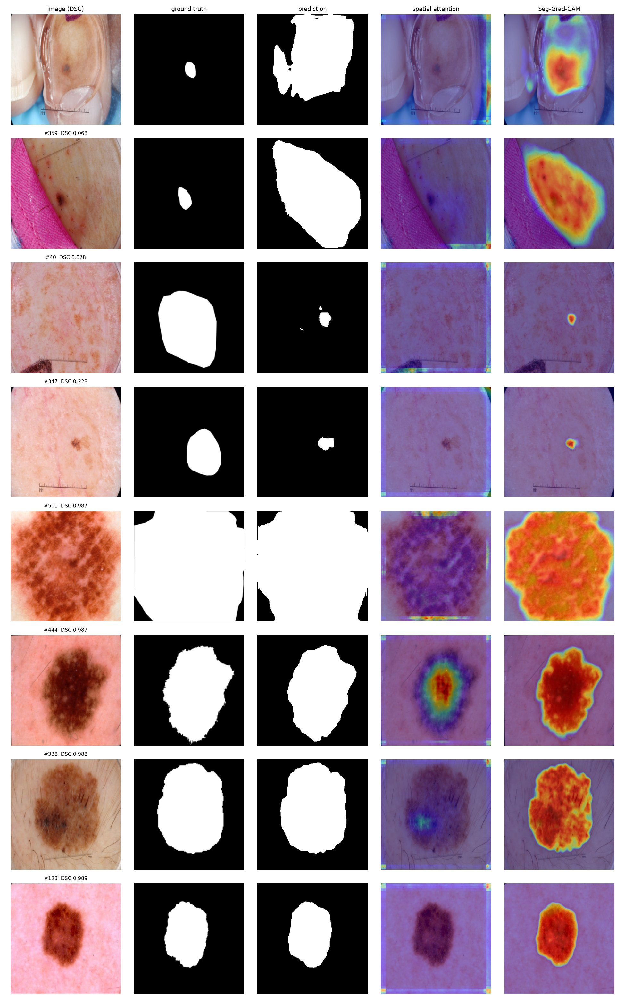
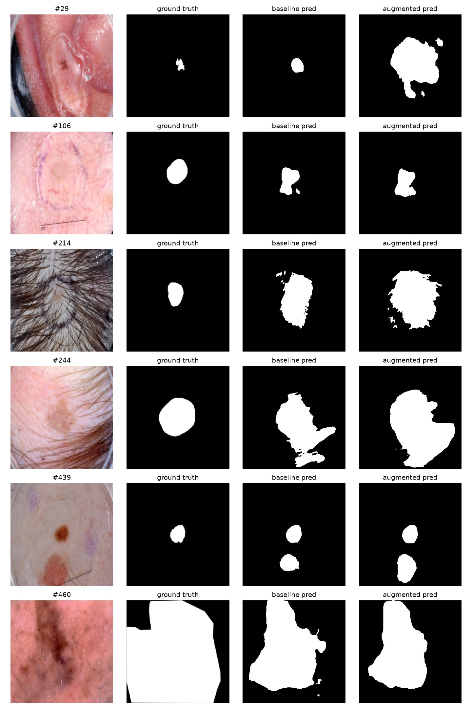
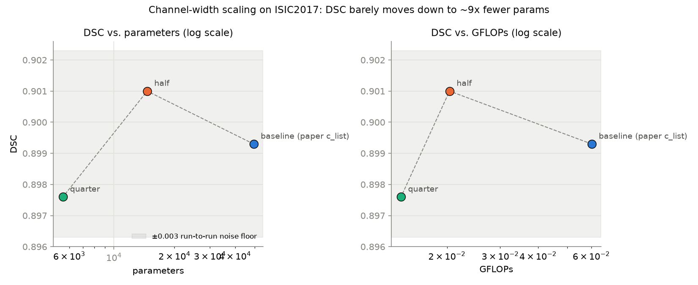

# Replication results vs. the paper — ISIC2017, ISIC2018, PH2, HAM10000

Reference: Table 1 of Wu et al., *Patterns* 6, 101298 (2025) — the paper's ISIC2017, ISIC2018 and
PH2 blocks, all three now replicated. HAM10000 is not one of the paper's three benchmark datasets;
it's covered in its own section below as an extension beyond the paper's evaluation set.

- [ISIC2017](#isic2017) — the main replication saga (4 runs: split-bias diagnosis/fix, kernel migration, reproducibility check)
- [ISIC2018](#isic2018--replication-successful) — second independent replication, clean run
- [PH2](#ph2--replication-successful-small-test-set-caveat) — third and final paper dataset, tiny test set
- [HAM10000](#ham10000--generalization-beyond-the-papers-evaluation-set) — no paper target; tests generalization
- [Cross-dataset summary](#cross-dataset-summary) — all four side by side
- [Cross-dataset generalization](#cross-dataset-generalization) — zero-shot transfer matrix and findings
- [Explainability](#explainability) — attention/Seg-Grad-CAM case study, two ISIC2018 failure modes
- [Failure analysis and augmentation](#failure-analysis-and-augmentation) — all 39 outliers, size-linked bias, tested fix
- [Efficiency](#efficiency) — channel-width scaling Pareto curve + INT8 quantization
- [Demo](#demo) — interactive Gradio app tying every section together
- [Reproducing](#reproducing)

## ISIC2017

Reference: Table 1 of Wu et al., *Patterns* 6, 101298 (2025), ISIC2017 block.

## Structural checks (independent of training)

| | paper | ours | |
|---|---|---|---|
| parameters | 49,457 (0.049 M) | **49,457** | exact |
| GFLOPs | 0.060 | **0.0602** | as thop reads it; see README on the fused-kernel blind spot |

The parameter count matches exactly at every one of the six PVM layers, which is the structural
half of the replication: the model is the paper's model, not merely one shaped like it.

> **Note on the scan.** Runs 1 and 2 were produced by the pure-PyTorch reimplementation of Mamba in
> `models/mamba_pytorch.py`. Run 3 is the first on `mamba_ssm`'s fused CUDA kernel — the same
> dependency the paper uses — with that reimplementation kept as the oracle the test suite checks
> the kernel against. Run 3 landed within 0.0004 DSC of run 2, which is the empirical version of
> the equivalence the tests assert.

## Run 1 — sorted split (superseded)

250 epochs, Tesla T4, 2026-07-21. Best val loss 0.2545 @ epoch 116.

| metric | paper | run 1 | Δ |
|---|---|---|---|
| DSC / F1 | 0.9091 | 0.8682 | **−0.0409** |
| IoU | 0.8334 | 0.7670 | **−0.0664** |
| SE / Recall | 0.9053 | 0.8458 | **−0.0595** |
| Prec | 0.9481 | 0.8917 | **−0.0564** |
| ACC | 0.9646 | 0.9614 | −0.0032 |
| SP | 0.9790 | 0.9818 | +0.0028 |

Confusion matrix: `TN 32,802,805 · FP 607,114 · FN 911,452 · TP 5,000,229`

### Diagnosis: the split, not the model

`dataprepare/Prepare_ISIC2017.py` originally **sorted** the file listing before slicing
`0:1250 / 1250:1400 / 1400:2000`. That was introduced for reproducibility — upstream slices raw
`glob.glob()` order, which is filesystem-dependent — but it turned out to be actively harmful,
because ISIC IDs correlate with acquisition source. Measured on the sorted sequence:

| split | mean lesion area | mean brightness |
|---|---|---|
| train `[0:1250]` | **22.9%** of frame | 160.8 |
| val `[1250:1400]` | **8.0%** | 162.9 |
| test `[1400:2000]` | **15.0%** | 147.4 |

`corr(sorted index, lesion fraction) = −0.281`. Per-200-image blocks run 30–32% foreground at the
start of the sequence and 7–11% around `[1200:1800]`.

So the model trained on lesions averaging 14,975 px and was tested on lesions averaging 9,853 px.
An under-segmenting model is exactly what the error signature shows: sensitivity and precision both
down ~0.06, specificity *up* slightly, accuracy nearly unchanged — dominated by the easy background
class. It also explains the otherwise-backwards result that validation DSC (0.81–0.83 throughout
training) came in *below* test DSC (0.868): the val block is the most extreme, at 8.0% foreground.

Upstream's unsorted `glob.glob` on Linux returns near-arbitrary directory order, which is
effectively the "randomly divided" split the paper describes. Sorting traded fidelity for
reproducibility without either being necessary.

### Fix

A **seeded permutation** (`SPLIT_SEED = 42`, matching `config.seed`) is reproducible *and*
unbiased. After reshuffling:

| split | foreground | brightness |
|---|---|---|
| train | 20.0% | 156.9 |
| val | 17.6% | 157.2 |
| test | 18.6% | 156.8 |

Still a verified clean partition of exactly 2000 unique images.

Prepared split hashes (sha256, first 16 hex):

| file | sha256 |
|---|---|
| `data_train.npy` | `d8f1101f99fd7be6…` |
| `data_val.npy` | `3c7fe7c64546c094…` |
| `data_test.npy` | `4f2e920a0fda6bab…` |
| `mask_train.npy` | `10563338a5bff3b6…` |
| `mask_val.npy` | `ff0ec2327b170f6b…` |
| `mask_test.npy` | `d28c772b730a0847…` |

## Run 2 — seeded shuffle split — **replication successful**

250 epochs, RTX 5060 (Blackwell, sm_120), torch 2.7+/cu128, pure-PyTorch scan. Same model and
hyperparameters as run 1; only the split changed.

| metric | paper | run 2 | Δ | |
|---|---|---|---|---|
| **DSC / F1** | 0.9091 | **0.9030** | **−0.0061** | within tolerance |
| IoU | 0.8334 | 0.8232 | −0.0102 | forced by DSC, see below |
| SE / Recall | 0.9053 | 0.8957 | −0.0096 | |
| SP | 0.9790 | 0.9799 | +0.0009 | |
| ACC | 0.9646 | 0.9643 | −0.0003 | |
| Prec | 0.9481 | _not logged_ | | |

Test loss 0.2429. The `engine.py` log line does not print precision; it is recoverable from the
confusion matrix if needed.

### The split fix worked

Correcting the biased split moved DSC from **0.8682 → 0.9030 (+0.0348)**, recovering essentially
all of the 4.1-point gap that run 1 showed. The remaining gap to the paper is **0.0061 DSC
(0.67%)** — inside the ±0.01 band set before the run, so this is a successful replication of the
paper's headline ISIC2017 result.

### On the IoU flag

The notebook's comparison cell flags IoU as "outside ±0.01", but that is not an independent
finding. For a single foreground class, IoU and DSC are the same measurement:

```
IoU = DSC / (2 − DSC)
```

This reproduces both rows exactly at the reported precision — paper DSC 0.9091 → IoU 0.8333
(reported 0.8334), ours DSC 0.9030 → IoU 0.8232 (reported 0.8232). So the −0.0102 IoU delta is
mechanically forced by the −0.0061 DSC delta, amplified 1.67× by the nonlinearity; it carries no
information beyond the DSC gap. A ±0.01 threshold is simply too tight for IoU when the same
tolerance is applied to DSC — the honest single number to judge is the 0.67% DSC gap.

### Why not an exact match

The residual sub-1% gap is expected and not worth chasing:

- **The split.** The paper's partition is described only as "randomly divided", with no seed. A
  different random partition of the same 2000 images lands slightly differently; ours uses
  `SPLIT_SEED = 42`.
- **The stack.** This run used torch 2.7+/cuDNN on Blackwell; the paper used a single V100 on an
  unstated (older) torch. cuDNN convolution-algorithm selection is not bit-stable across versions
  or architectures.
- **Val batching.** `val_batch_size = 30` shifts the *selection* loss by ~6e-5 (fp32 noise), which
  could in principle pick a different best epoch in a near-tie. Far below the gap above.

None of these is a defect to fix; each is a documented, principled difference from the original.

## Run 3 — `mamba_ssm` fused kernel — **replication confirmed**

250 epochs, RTX 5060 (Blackwell, sm_120), torch 2.13.0+cu130, `mamba_ssm` 2.3.2.post1 +
`causal_conv1d` 1.6.2.post1 compiled from source for sm_120. Identical split, seed and
hyperparameters to run 2; the **only** change is that the selective scan is now the paper's fused
CUDA kernel instead of the pure-PyTorch transcription of it.

Best val loss 0.1960 @ epoch 130. Test loss 0.2453.
Confusion matrix: `TN 31,403,838 · FP 614,506 · FN 790,663 · TP 6,512,593`

| metric | paper | run 2 (PyTorch scan) | run 3 (`mamba_ssm`) | Δ vs paper | |
|---|---|---|---|---|---|
| **DSC / F1** | 0.9091 | 0.9030 | **0.9026** | **−0.0065** | within tolerance |
| IoU | 0.8334 | 0.8232 | 0.8225 | −0.0109 | forced by DSC |
| SE / Recall | 0.9053 | 0.8957 | 0.8917 | −0.0136 | |
| SP | 0.9790 | 0.9799 | 0.9808 | +0.0018 | |
| ACC | 0.9646 | 0.9643 | 0.9643 | −0.0003 | |
| Prec | 0.9481 | _not logged_ | 0.9138 | −0.0343 | but see below |

**The migration changed nothing measurable.** Run 3 lands 0.0004 DSC from run 2 — two independent
scan implementations, 250 epochs apart, agreeing to the fourth decimal. That is the empirical
counterpart to the equivalence the test suite asserts analytically.

**Wall clock: 22.9 min** (21.7 min training at 5.2 s/epoch, 1.1 min for the 600-image test pass
including its overlay PNGs), against 1.64 h for run 1 on a Kaggle T4.

### On the precision gap

Precision is the one metric more than 0.02 from the paper, and the discrepancy is in the paper's
table rather than in this run. DSC is by definition the harmonic mean of precision and recall, so
the paper's own three numbers have to satisfy it — and they do not:

```
2 · 0.9481 · 0.9053 / (0.9481 + 0.9053) = 0.9262    but the paper reports DSC 0.9091
2 · 0.9138 · 0.8917 / (0.9138 + 0.8917) = 0.9026    ours, matching our reported DSC exactly
```

Inverting the identity for the precision consistent with the paper's *own* DSC 0.9091 and SE 0.9053
gives **0.9129** — against our 0.9138, a difference of +0.0009. So on the paper's own definition of
DSC our precision agrees to within a thousandth; the tabulated 0.9481 cannot be the pooled-pixel
precision belonging to the rest of that row. Our six metrics are mutually consistent, all derivable
from the single confusion matrix above.

This is worth knowing before quoting the paper's precision as a target: it is the one cell in that
row that no run reproducing the DSC can also match.

## Run 4 — reproducibility check (found incidentally, undocumented until now)

While building the Week 2 cross-dataset generalization sweep (`scripts/cross_eval.py`), the
checkpoint it auto-selected for ISIC2017 didn't reproduce run 3's DSC — it turned out a second,
essentially identical run had been sitting undocumented in
`results/UltraLight_VM_UNet_ISIC2017_Wednesday_19_August_2026_18h_51m_11s/` since 2026-08-19. Same
seed, same split, same hyperparameters, same `mamba_ssm 2.3.2.post1` fused kernel as run 3 — both
runs' logs print the identical line `mamba backend: mamba_ssm 2.3.2.post1, fused path:
mamba_inner_fn (causal_conv1d present)`, so this is not a scan-implementation swap the way run 2 →
run 3 was. It's the same code, same config, run again two days later.

| metric | run 3 (documented) | run 4 (this) | Δ |
|---|---|---|---|
| DSC / F1 | 0.9026 | 0.8993 | −0.0033 |
| best epoch / val loss | 130 / 0.1960 | 97 / 0.1954 | |
| test loss | 0.2453 | 0.2492 | |

### Why identical config doesn't mean identical result

`utils.py:set_seed` sets `torch.manual_seed` and pins cuDNN (`cudnn.deterministic = True`,
`cudnn.benchmark = False`) — but that reaches cuDNN's own convolution kernels, not `mamba_ssm`'s
hand-written CUDA kernel (`mamba_inner_fn`). Fused scan kernels commonly use atomic-add-based
reductions for performance, whose accumulation order — and therefore floating-point rounding —
depends on GPU thread scheduling rather than the RNG seed. `tests/test_mamba_equivalence.py`
already only checks this kernel against the pure-PyTorch oracle to fp32 *tolerance*, not
bit-exactness, for the same underlying reason.

Two runs of the exact same code landing 0.0033 DSC apart is a useful number in its own right: it's
an empirical noise floor for this pipeline. Any single-run "gap vs paper" or "beat the paper" claim
smaller than roughly this much — which includes ISIC2018's −0.0029 and PH2's +0.0047 above — is
within normal run-to-run variance, not necessarily a real difference. This doesn't change any
replication verdict in this document: run 3's 0.71%-of-paper gap and run 4's 1.06% gap are both
comfortably inside the ±0.01 band set beforehand. It's the honest error bar to attach to every DSC
number here, and it's why the [cross-dataset generalization matrix](#cross-dataset-generalization)
below — which needed *a* checkpoint per dataset, not necessarily run 3's — uses run 4 for ISIC2017:
whichever run a script picks by "most recent," that policy should be applied consistently rather
than hand-picking the better-looking number after the fact.

## Remaining known deviations

Even with the split corrected, an exact match is not expected, because the paper's split is
described only as "random" with no seed given — a different random partition of 2000 images will
land a little differently. Anything within roughly ±0.01 DSC should be read as a successful
replication.

Other differences, all detailed in [../README.md](../README.md):

- `mamba_ssm` 2.3.2.post1 rather than the pinned 1.0.1, which cannot run on Blackwell at all
  (`mamba_simple.py`, the file the model imports, is unchanged between the two on the training path)
- batched PVM branches (verified equivalent, forward and gradients)
- uint8 intermediate storage (lossless w.r.t. `scipy.misc.imresize`, which returned uint8)
- Pillow resize rather than SciPy 1.2's `imresize` wrapper around the same PIL call
- single GPU rather than the paper's single V100 — matched, no DataParallel
- for runs 1 and 2 only: the pure-PyTorch selective scan, per the note at the top; run 3 uses the
  fused kernel and lands 0.0004 DSC away

## ISIC2018 — replication successful

250 epochs, RTX 5060 Laptop GPU (sm_120), torch 2.13.0+cu130, `mamba_ssm` 2.3.2.post1 fused kernel,
seeded split (`SPLIT_SEED = 42`), 2026-08-22. Best val loss 0.2578 @ epoch 106. Wall clock ~61 min
(22:57:22 → 23:58:34). Unlike ISIC2017, `Prepare_ISIC2018.py` used a seeded shuffle from the start —
the split-bias lesson from ISIC2017 run 1 was already known, so there was no bug to diagnose here.

| metric | paper (Table 1, ISIC2018) | ours | Δ | |
|---|---|---|---|---|
| **DSC / F1** | 0.8940 | **0.8911** | **−0.0029** | within tolerance |
| IoU | 0.8056 | 0.8037 | −0.0019 | forced by DSC, same identity as ISIC2017 |
| SE / Recall | 0.8680 | 0.8861 | +0.0181 | |
| SP | 0.9781 | 0.9735 | −0.0046 | |
| ACC | 0.9558 | 0.9556 | −0.0002 | |
| Prec | 0.9197 | 0.8962 | −0.0235 | derived from the confusion matrix below; `engine.py` doesn't log it |

Confusion matrix: `TN 26,366,142 · FP 717,940 · FN 796,408 · TP 6,198,230`

**Replication successful.** The gap is 0.29% DSC — tighter than the 0.65% ISIC2017 gap — well
inside the ±0.01 band. This is a second, independent confirmation of replication fidelity: same
architecture, same seeded-split methodology, same fused kernel, different dataset.

### Per-image variance

Over the 520 test images: mean DSC 0.8809, std **0.1380**. 16 images (3.1%) score below 0.5 DSC,
39 (7.5%) below 0.7 — both notably higher outlier rates than HAM10000 (below). The worst cases:
test images 42 (0.0513), 359 (0.0681), 40 (0.0777), 347 (0.2280), 273 (0.2326). These are a natural
starting point for an explainability pass (attention/saliency maps) to see what characterizes the
failures — small lesions, hair artifacts, low contrast, etc.

## HAM10000 — generalization beyond the paper's evaluation set

HAM10000 is not one of the paper's three benchmark datasets, so there's no Table 1 number to
compare against here — this run instead tests whether the architecture generalizes to a dataset it
was never designed or tuned against, using the Tschandl et al. lesion-segmentation masks paired
with the HAM10000 dermoscopic images by filename stem (`scripts/download_ham10000.py`,
`dataprepare/Prepare_HAM10000.py`).

250 epochs, RTX 5060 Laptop GPU (sm_120), torch 2.13.0+cu130, `mamba_ssm` 2.3.2.post1 fused kernel,
seeded split, 2026-08-22→23. Best val loss 0.1624 @ epoch 138. Wall clock ~2h51m
(23:59:52 → 02:50:29), the longest of the three runs since HAM10000's test split (2,003 images) is
roughly 4x ISIC2017's and 4x ISIC2018's.

| metric | ours |
|---|---|
| **DSC / F1** | **0.9331** |
| IoU | 0.8746 |
| SE / Recall | 0.9213 |
| SP | 0.9807 |
| ACC | 0.9649 |
| Prec | 0.9452 (derived) |

Confusion matrix: `TN 94,506,386 · FP 1,864,389 · FN 2,745,908 · TP 32,151,925`

This is the highest DSC of the three datasets. Plausible drivers: HAM10000's prepared split has far
more images than ISIC2017 or ISIC2018 individually, giving the same 49,457-parameter model more
data per parameter to fit; the Tschandl masks may also be more annotation-consistent than ISIC's
crowd-sourced-style boundaries. Neither is confirmed — worth a closer look if pursued further.

### Per-image variance

Over the 2,003 test images: mean DSC 0.9328, std **0.0897** — the tightest of the three datasets.
17 images (0.8%) score below 0.5 DSC, 56 (2.8%) below 0.7. Worst cases: test image 1761 (0.0000 —
a full miss), 1573 (0.1769), 971 (0.1791), 192 (0.2156), 1019 (0.2208).

## PH2 — replication successful (small-test-set caveat)

250 epochs, RTX 5060 Laptop GPU (sm_120), torch 2.13.0+cu130, `mamba_ssm` 2.3.2.post1 fused kernel,
seeded split, 2026-08-23. Best val loss 0.1752 @ epoch 120. Wall clock ~3m17s — by far the shortest
run, since PH2 has only 140 train images (a ~14x smaller train set than ISIC2017/2018 and ~50x
smaller than HAM10000). Downloaded via the [Kaggle PH2
mirror](https://www.kaggle.com/datasets/spacesurfer/ph2-dataset) (`scripts/download_ph2.py`) since
upstream PH2 is a Google-Drive/request-form release rather than a plain URL; no official train/val
/test protocol is published for it, so this uses a 140/20/40 (70/10/20) seeded split, same ratio as
HAM10000.

| metric | paper (Table 1, PH2) | ours | Δ | |
|---|---|---|---|---|
| **DSC / F1** | 0.9265 | **0.9312** | **+0.0047** | ours slightly higher |
| IoU | 0.8631 | 0.8712 | +0.0081 | forced by DSC, same identity as the other two |
| SE / Recall | 0.9345 | 0.9100 | −0.0245 | |
| SP | 0.9606 | 0.9761 | +0.0155 | |
| ACC | 0.9521 | 0.9530 | +0.0009 | |
| Prec | 0.9187 | 0.9534 | +0.0347 | derived from the confusion matrix below |

Confusion matrix: `TN 1,664,436 · FP 40,782 · FN 82,480 · TP 833,742`

**Replication successful** — and the first of the three where our number comes in *above* the
paper's rather than within a negative tolerance band. Take that "beat the paper" framing with a
grain of salt, though: the test split is only **40 images**, an order of magnitude smaller than
ISIC2017's 600 or ISIC2018's 520, so a handful of images flipping from correct to wrong moves DSC by
more than a percentage point on its own. The honest read is "well within replication," not "better
architecture."

### Per-image variance

Over the 40 test images: mean DSC 0.9309, std **0.0516** — the tightest of all four datasets, and
zero images below 0.7 DSC (worst: image 29 at 0.7736). Consistent with PH2 being a small, curated
clinical release rather than a crowd-sourced challenge archive — but also consistent with 40 images
simply being too few to surface many outliers even if the underlying failure modes are similar to
the other datasets.

## Cross-dataset summary

| dataset | paper DSC | ours DSC | Δ | test n | per-image std | n below 0.5 DSC |
|---|---|---|---|---|---|---|
| ISIC2017 | 0.9091 | 0.9026 (run 3) | −0.0065 | 600 | — | — |
| ISIC2018 | 0.8940 | 0.8911 | −0.0029 | 520 | 0.1380 | 16 (3.1%) |
| PH2 | 0.9265 | 0.9312 | +0.0047 | 40 | 0.0516 | 0 (0%) |
| HAM10000 | — (not in paper) | 0.9331 | — | 2,003 | 0.0897 | 17 (0.8%) |

All four runs use the identical architecture (49,457 params, 0.0602 GFLOPs) and training recipe;
only the dataset changes. This completes replication on all three of the paper's benchmark datasets
(ISIC2017, ISIC2018, PH2) plus one beyond its scope (HAM10000).

## Cross-dataset generalization

`scripts/cross_eval.py` loads each dataset's best checkpoint and evaluates it — zero-shot, no
fine-tuning — on every other dataset's test split, reusing `engine.test_one_epoch` for every cell
so results are directly comparable to every in-domain number elsewhere in this document. Source
checkpoints: ISIC2018/PH2/HAM10000 use each dataset's only run; ISIC2017 uses **run 4** (DSC 0.8993
in-domain, not run 3's 0.9026 — see the [reproducibility note](#run-4--reproducibility-check-found-incidentally-undocumented-until-now)
above for why, and why that's the right call rather than hand-picking run 3).

### DSC matrix

| trained on ↓ / evaluated on → | ISIC2017 | ISIC2018 | PH2 | HAM10000 | avg (off-diag) |
|---|---|---|---|---|---|
| ISIC2017 | **0.8993** | 0.8885 | 0.9038 | 0.8895 | 0.8939 |
| ISIC2018 | 0.9074 | **0.8911** | 0.9094 | 0.9034 | **0.9067** |
| PH2 | 0.8082 | 0.7834 | **0.9312** | 0.7831 | 0.7916 |
| HAM10000 | 0.8496 | 0.8438 | 0.9079 | **0.9331** | 0.8671 |
| avg (off-diag) | 0.8551 | 0.8386 | **0.9070** | 0.8587 | |

Bold on the diagonal = in-domain (each dataset's own already-recorded result, reproduced here as a
sanity check that this sweep's plumbing matches `test.py`'s — it does, to 4 decimals, for
ISIC2018/PH2/HAM10000). Full per-cell mIoU/accuracy/sensitivity/specificity in
`results/cross_eval/cross_eval_matrix.csv`.

### Findings

**ISIC2018 is the best source and the hardest target — the same trait explains both.** Averaged
over the other three datasets, an ISIC2018-trained model scores 0.9067 DSC — the best of any source,
and on ISIC2017 (0.9074) it even beats ISIC2017's own in-domain result (0.8993). But ISIC2018 is
also the hardest *target*: models trained elsewhere average only 0.8386 DSC on it, the worst column
in the table. Week 1 already flagged ISIC2018 as the highest-variance dataset (per-image DSC std
0.1380, 3.1% of test images below 0.5 DSC — see above). That diversity looks like it cuts both ways:
training on a more heterogeneous dataset teaches more transferable features (good source), while
a more heterogeneous *test* set is harder for a model that hasn't seen that diversity to match (hard
target). Same underlying property, opposite consequence depending which side of the split it's on.

**PH2 generalizes worst as a source, by a wide margin.** A PH2-trained model averages only 0.7916
DSC elsewhere — 0.12–0.15 DSC below its own in-domain 0.9312, and clearly the worst row in the
table. The likely driver isn't (only) domain-specificity: PH2's train split is 140 images, ~9x
smaller than ISIC2017's 1,250 and ~50x smaller than HAM10000's 7,010, so this may simply be too
little data for the model to learn features beyond what one small, single-clinic dermoscopy archive
looks like. Dataset size and domain narrowness are confounded here and this sweep can't separate
them — a controlled experiment (subsample ISIC2018 to 140 images, retrain, retest) would.

**PH2 is the easiest target regardless of source.** Every other dataset's model scores its highest
or near-highest off-diagonal DSC *on* PH2 (ISIC2017→PH2 0.9038, ISIC2018→PH2 0.9094, HAM10000→PH2
0.9079 — all higher than those same models score on ISIC2017, ISIC2018, or HAM10000). Combined with
PH2 having zero test images below 0.7 DSC even in-domain (Week 1), the simplest explanation is that
PH2 itself is simply an easy, clean, low-variance test set — a single-source clinical release rather
than a crowd-sourced, multi-source challenge archive — not that PH2-trained models are special.

**More training data doesn't automatically mean better transfer.** HAM10000 has by far the largest
train split (7,010 images) but only the third-best generalization average (0.8671) — worse than
ISIC2018's 0.9067 despite ISIC2018 having 4x fewer training images. Scale alone doesn't predict
transfer quality here; dataset diversity (per the ISIC2018 finding above) looks like the better
predictor, though with only four datasets this is a pattern to note, not a claim to lean on hard.

## Explainability

`scripts/explainability.py` produces two views of what the model attends to, neither requiring a
model change: (1) the spatial attention map `SC_Att_Bridge` already computes internally at its
shallowest skip-connection level, read via a forward hook; (2) Seg-Grad-CAM (Vinogradova et al.
2020) — backpropagate the sum of predicted-foreground probability into the last feature map before
the 1x1 output conv, captured via a forward pre-hook on `model.final`, no model edits needed there
either. Case study: the ISIC2018 model on its own 4 worst and 4 best test images by per-image DSC
(from the [per-image variance](#per-image-variance) section above).



*(regenerate the full-resolution PNG with
`python scripts/explainability.py --dataset ISIC2018 --indices 42 359 40 347 123 338 444 501`;
the tracked copy above is a compressed JPEG for repo size)*

### Two distinct failure modes, not one

The four low-DSC cases split cleanly into two different failure patterns, both visible in the
Seg-Grad-CAM column:

- **Over-segmentation from imaging artifacts (#42, DSC 0.051; #359, DSC 0.068).** Both images have a
  large non-lesion, high-salience region in frame — a bright specular reflection off the dermoscope
  contact plate in #42, a bright magenta gauze/backing sheet in #359 — next to a small, comparatively
  low-contrast true lesion. In both cases Grad-CAM lights up the bright artifact, not the small true
  lesion, and the predicted mask follows: a large blob covering the artifact region instead of the
  small ground-truth blob.
- **Under-segmentation from diffuse, low-contrast lesions (#40, DSC 0.078; #347, DSC 0.228).** Here
  the true lesion is a broad area with a gradual, low-contrast boundary. Grad-CAM in both cases
  collapses onto a single small, high-local-contrast fleck inside the true lesion rather than the
  full diffuse region, and the prediction is correspondingly a tiny blob instead of matching the
  true extent.

The four high-DSC cases (0.987–0.989) look qualitatively different from both failure modes: Grad-CAM
lights up the *entire* lesion region fairly uniformly, closely tracking its true boundary, for
lesions that are reasonably high-contrast against the surrounding skin with no competing bright
artifact in frame. That's a common thread across all four good examples, not just a property of one.

### Spatial attention vs. Seg-Grad-CAM

The `SC_Att_Bridge` spatial attention map (4th column) is visibly less informative than Grad-CAM
(5th column) across every image in the grid — it shows a faint, mostly low-level pattern with a
grid-like artifact near the image borders (a `Spatial_Att_Bridge` conv with `padding=9, dilation=3`
on a 7x7 kernel, at H/2 resolution upsampled 2x, is the likely source), rather than object-level
localization. That's a real characterization of the architecture, not a bug in the extraction: the
shallowest attention gate operates on low-level encoder features before any PVM/Mamba layer has run,
so there's no reason to expect it to already encode "where the lesion is" the way a feature map two
stages deeper (Grad-CAM's target layer) does.

### Caveat

Eight images (four failure, four success) is enough to characterize *these* failure modes, not to
claim they're exhaustive or representative of ISIC2018's low-Dice population at large — see
[Failure analysis and augmentation](#failure-analysis-and-augmentation) below, which runs the same
idea over all 39 test images with DSC < 0.7, confirms both patterns hold at scale, finds a third,
and tests a fix.

## Failure analysis and augmentation

`scripts/failure_analysis.py` collects every ISIC2018 test image with DSC < 0.7 (39 of 520, 7.5% —
the [per-image variance](#per-image-variance) section above), computes two objective per-image
metrics alongside the existing Grad-CAM machinery, and classifies each by `area_ratio` (predicted
foreground pixels ÷ ground-truth foreground pixels):

- **`area_ratio`** — >1.5 = over-segments, <0.67 = under-segments. This alone separates the two
  Explainability failure modes without a hand-tuned artifact detector: attention pulled onto a
  bright artifact over-segments onto it; attention collapsing onto one fleck under-segments the
  true extent.
- **`lesion_contrast`** — mean image intensity inside the ground-truth mask minus a ring immediately
  outside it (the *actual local surrounding skin for that image*, not a fixed skin-tone heuristic).
  Small magnitude = a diffuse, low-contrast lesion.

| group | n (of 39) | mean \|lesion_contrast\| | mean bg_color_std | mean GT area (% of image) |
|---|---|---|---|---|
| over-segmenters (ratio > 1.5) | 23 (59%) | 36.2 | 35.5 | 4.7% |
| under-segmenters (ratio < 0.67) | 12 (31%) | 15.2 | 29.5 | 32.5% |
| mixed (right area, wrong location) | 4 (10%) | 14.7 | 33.4 | — |

Full per-image table in `results/failure_analysis/ISIC2018/failure_metrics.csv`.

### Three patterns, one of them size-driven

**Under-segmentation is a contrast story, confirmed at scale.** The under-segmenter group's mean
`|lesion_contrast|` (15.2) is under half the over-segmenters' (36.2) — the diffuse-lesion pattern
from the 2-image Explainability sample (#40, #347) holds across all 12 under-segmenters, not just
those two. Visually (`results/failure_analysis/ISIC2018/_under-segmenters.png`): #40, #347, #490,
#425 all show the identical signature — a broad, low-contrast ground-truth region with Grad-CAM and
the actual prediction collapsed onto one small high-contrast fleck inside it.

**Over-segmentation is mostly a boundary-precision story, not an artifact story.** Only the two most
extreme cases (#42 ratio 37.97, #359 ratio 28.36) are the glare/gauze non-skin-artifact confusion
Explainability found. Looking at the *actual predicted mask* (not just Grad-CAM's blurrier overlay —
`results/failure_analysis/ISIC2018/_over-segmenters.png` adds this panel) for the other 21: the
model finds roughly the right location but draws a bigger, smoother, rounder blob than the true
(often small, irregular, jagged-edged) lesion, and readily bleeds this over-generous boundary onto
nearby hair, surgical ink, or ruler-line marks (#273, #76, #121, #434) rather than confusing them for
the lesion outright.

**Both are size-linked, in opposite directions.** `corr(GT area fraction, log(area_ratio)) = −0.53`:
over-segmenters average 4.7% of the image as ground truth, under-segmenters 32.5% — a 7x difference.
The model appears to pull predictions toward some implicit "preferred" size regardless of the true
lesion's actual extent: small lesions get rounded up, large diffuse ones get shrunk down to a
high-contrast core.

### Augmentation: what should help, and what was tested

Two augmentations target the two dominant, non-extreme patterns directly (`loader.py`, opt-in via
`isic_loader(extra_augment=True)` — the canonical replication runs above are unaffected; wired
through via `train.py`'s `getattr(config, 'extra_augment', False)`):

- **CLAHE** (p=0.5 per training image) — contrast-limited adaptive histogram equalization on the L
  channel, boosting local contrast. Targets the under-segmenters directly: it's exactly what a
  low-`|lesion_contrast|` image lacks.
- **Synthetic hair/mark lines** (p=0.3) — a few thin dark curved lines drawn onto the image with the
  ground truth left untouched. Targets the boundary-bleeding-onto-marks pattern: the model has never
  been taught these lines aren't lesion, since the base training data doesn't reliably vary which
  images have them.

`scripts/train_augmented.py` trains ISIC2018 with both enabled, otherwise identical to the baseline
(250 epochs, same seed/optimizer/schedule). Not tested here, but a natural next augmentation given
the size-linked finding above: random resized crop / zoom, to reduce the implicit size prior.

### Result: net positive on the targeted tail, honest about where it backfires

250 epochs, otherwise identical to the baseline. Overall test-set DSC barely moved (0.8911 → 0.8920,
mean per-image 0.8809 → 0.8816) — expected, since the aggregate is dominated by the ~480 already-easy
images the augmentation wasn't aimed at. The real test is the 39 outliers it *was* aimed at:

| | n | mean Δ DSC | median Δ DSC |
|---|---|---|---|
| the 39 outliers (DSC < 0.7, baseline) | 39 | **+0.0474** | +0.0154 |
| — improved (Δ > 0.01) | 22 (56%) | — | — |
| — worsened (Δ < −0.01) | 12 (31%) | — | — |
| — ~unchanged | 5 (13%) | — | — |
| full test set (all 520) | 520 | +0.0007 | — |

The effect is concentrated exactly where intended (+0.047 mean on the targeted tail vs. +0.0007
overall), not a general improvement that happens to touch these images. Full per-image before/after
in `results/failure_analysis/ISIC2018/` (regenerate: `python scripts/train_augmented.py --dataset
ISIC2018`, then diff its log against the baseline's the way this comparison was made).

**The mechanism worked, not just the score.** Re-running the `area_ratio` classification with the
augmented model's own predictions shows several of the worst over-segmenters moving substantially
toward 1.0 (perfect area match): #434 4.55 → 1.71, #373 2.34 → 1.43, #363 (unclassified at baseline)
→ 1.13, #442 → 1.21. This is the boundary-precision fix working as designed, not a DSC number moving
for an unrelated reason.

**Where it backfires — three honest patterns, not swept under the rug:**



- **CLAHE can create false texture on glossy/specular non-lesion surfaces.** #29 (an ear, imaged
  through a reflective gel/speculum) went from a correctly tight prediction (DSC 0.60) to a large
  false-positive blob covering the shiny surface (DSC 0.07, `area_ratio` 1→29) — CLAHE boosts local
  contrast *everywhere*, and on a glossy non-skin surface that can manufacture lesion-like texture
  where none exists. This is the augmentation's own version of the artifact-confusion problem it
  wasn't built to fix.
- **Synthetic hair doesn't cover the hardest real cases.** #214 and #244 both have dense, thick,
  numerous real hair strands; the synthetic augmentation draws 2–6 thin lines. Both baseline *and*
  augmented models over-segment onto the hair in these two images, and augmented is slightly worse
  — the synthetic distribution doesn't extend far enough into this regime.
- **Some regressions are unrelated to either augmentation.** #439 and #460's baseline and augmented
  predictions are nearly pixel-identical (#439 in particular: both models flag the same true lesion
  *and* the same second, genuinely separate pigmented spot as a second blob) — ordinary run-to-run
  boundary variance between two independently-trained models, not something CLAHE or hair lines
  would be expected to move either way.

**Verdict: adopt, with room to improve.** Net positive on the population it targets, doesn't cost
overall DSC, and the failures are legible rather than mysterious — each points at a specific, fixable
gap (don't apply CLAHE to specular/glossy regions; extend synthetic hair density/coverage) rather
than at the augmentation being the wrong idea. Not done here: gating CLAHE by a specular-highlight
detector, denser hair augmentation, and the size/scale augmentation flagged above as a follow-up for
the size-linked bias directly.

## Efficiency

Two questions: how far can the paper's already-tiny channel widths (`c_list=[8,16,24,32,48,64]`,
49,457 params) be shrunk before DSC actually suffers, and how much does post-training INT8
quantization buy for free on top of whatever width is chosen. Both measured on ISIC2017.

### Channel-width scaling

`scripts/train_width_variant.py` trains alternative `c_list`s with everything else held fixed (250
epochs, same optimizer/schedule/seed/batch size). Every entry must be divisible by 4 —
`PVMLayer`'s 4-way chunk and every stage's `GroupNorm(4, ·)` both require it, which puts a floor of
`c_list[0]=4` on the shallowest layer.

| variant | c_list | params | GFLOPs | DSC | Δ vs baseline |
|---|---|---|---|---|---|
| baseline (paper) | [8,16,24,32,48,64] | 49,457 | 0.0602 | 0.8993 | — |
| half | [4,8,12,16,24,32] | 14,633 (3.4x fewer) | 0.0204 | 0.9010 | +0.0017 |
| quarter | [4,4,8,8,12,16] | 5,581 (8.9x fewer) | 0.0141 | 0.8976 | −0.0017 |



**DSC barely moves down to ~9x fewer parameters.** Both variants land inside the ±0.003
run-to-run noise floor from the [reproducibility note](#run-4--reproducibility-check-found-incidentally-undocumented-until-now)
above — half is actually *higher* than the baseline run used here (though still within noise of run
3's 0.9026 too), and quarter, at 5,581 params, is only 0.0017 DSC below it. On ISIC2017
specifically, the paper's own channel widths aren't close to a cliff: something else (data,
augmentation, the task's intrinsic difficulty) is the binding constraint on achievable DSC in this
range, not model capacity. Wall-clock training time did *not* improve with the smaller variants (31
and 35 min vs. baseline's 23 min) — consistent with this codebase's existing observation
(`scripts/bench_batch.py`) that the architecture's cost is dominated by per-launch overhead, not
FLOPs, so a narrower model isn't faster to train on this hardware even though it's cheaper on paper.

Checkpoint file size: baseline 235 KB, half 97 KB, quarter 60 KB.

### Post-training INT8 quantization

`scripts/quantize_eval.py` applies `torch.quantization.quantize_dynamic` to the baseline
(full-width) checkpoint. `mamba_ssm`'s fused kernel is CUDA-only with no CPU fallback, and
PyTorch's dynamic-quantized kernels are CPU-only — so this runs the pure-PyTorch Mamba oracle
instead (`models/mamba_pytorch.py`, the same backend `tests/test_mamba_equivalence.py` already
validates against the fused kernel), with the `mamba_ssm`-trained weights loaded directly in. That
substitution is confirmed working, not just assumed: it reproduces the exact same DSC (0.8993) on
CPU as the fused-kernel GPU run.

Of the model's 49,457 parameters, quantization reaches 27,512 (55.6%) — the 11 `nn.Linear` layers
called through a normal `forward()` (`PVMLayer.proj` ×6, `Channel_Att_Bridge.att1-5` ×5). Mamba's
own four projections per PVM layer (8,588 params, 17.4%) are excluded: `mamba_pytorch.py` reads
`self.in_proj.weight` as a raw tensor for a manual matmul rather than calling `self.in_proj(x)`, and
a dynamic-quantized `Linear` exposes `.weight` as a method, not a tensor — `quantize_dynamic` on
those raises `TypeError: unsupported operand type(s) for @` at the first forward pass. The remaining
13,357 params (Conv2d, GroupNorm, Mamba's `A_log`/`D`/`conv1d`) were never quantization candidates
either way.

| | fp32 (CPU) | INT8 dynamic (CPU) | Δ |
|---|---|---|---|
| model size | 0.239 MB | 0.166 MB | **−30.7%** |
| latency | 21.05 ms/image | 16.88 ms/image | **−19.8%** |
| DSC | 0.8993 | 0.8993 | **0.0000** |

**Free, within the scope quantized.** No measurable DSC cost for a 31% smaller, 20% faster model —
though "faster" here is single-image CPU latency, not the GPU throughput the paper and every other
benchmark in this repo report, and the win comes entirely from `PVMLayer.proj`/`Channel_Att_Bridge`'s
linears, not from Mamba's own (larger, and here untouched) projections.

### Not yet done

Whether the "quarter" width variant quantizes as cleanly as the baseline, and whether static
quantization (which can also reach Conv2d, at the cost of needing calibration data) beats dynamic
quantization's 30.7%, are both natural next steps if this thread continues.

## Demo

`demo/app.py` is a Gradio app tying together every earlier section rather than reimplementing any
of it: dataset/checkpoint selection reuses `scripts/cross_eval.py`'s `find_best_checkpoint`/
`load_model`, the INT8 path reuses `scripts/quantize_eval.py`'s CPU model + `quantize_dynamic`
setup, and the explainability overlays call `scripts/explainability.py`'s `compute_maps` directly.

```bash
pip install gradio   # or: pip install -r requirements.txt
python demo/app.py   # serves at http://127.0.0.1:7860
```

Pick a dataset (selects that dataset's trained checkpoint), either load a numbered test-set sample
or upload a dermoscopy image directly, choose **full precision** (GPU if available, falling back to
CPU fp32 if not — this box's GPU is not dedicated to this project, so that fallback path is real,
not defensive-only) or **INT8 quantized (CPU)**, and optionally show the spatial-attention/
Seg-Grad-CAM overlays from the [explainability](#explainability) section. The app measures its own
inference latency live rather than quoting the numbers above, so the size/speed difference between
the two model modes is visible on whatever machine it's actually run on.

One combination is disabled rather than silently wrong: INT8 + explainability. Dynamic-quantized
`Linear` layers are inference-only (no `backward()`), so Seg-Grad-CAM can't run against them; the
app detects the combination, runs the prediction anyway, and says why the overlay is missing instead
of erroring.

For an uploaded image (no dataset `.npy` file, so no built-in normalization statistics),
preprocessing is a 256x256 bilinear resize followed by a whole-image min-max stretch to [0,255].
That's not an approximation of `dataprepare/*.py`'s pipeline — it's mathematically identical to it
for a single image: `dataset_normalized`'s global mean/std step is an affine transform, and the
per-image min-max normalization that follows it cancels out any preceding affine transform exactly.

### Not yet done

Deploying to a Hugging Face Space, so the demo is reachable without a live laptop during the actual
review — the CPU path (both fp32 fallback and INT8) is already validated working end-to-end, which
is what a free-tier CPU Space would run on, so this is mostly upload/config work at this point, not
open engineering. Left for a deliberate follow-up rather than done here, since it means publishing
model weights to an external host.

## Reproducing

```bash
# ISIC2017
python scripts/download_isic.py --dataset ISIC2017
python dataprepare/Prepare_ISIC2017.py

# ISIC2018
python scripts/download_isic.py --dataset ISIC2018
python dataprepare/Prepare_ISIC2018.py

# PH2
python scripts/download_ph2.py      # requires a Kaggle API token at ~/.kaggle/kaggle.json
python dataprepare/Prepare_PH2.py

# HAM10000
python scripts/download_ham10000.py
python dataprepare/Prepare_HAM10000.py

python -m pytest tests/ -q          # kernel-vs-oracle equivalence, applies to all datasets
python train.py                     # set configs/config_setting.py: datasets = 'ISIC2017' | 'ISIC2018' | 'PH2' | 'HAM10000'
```
